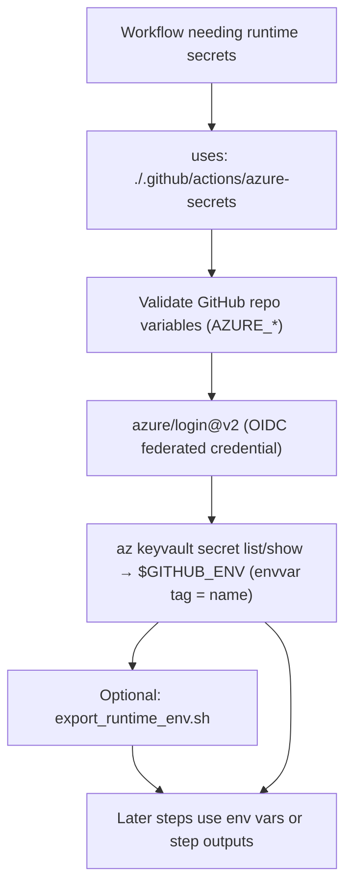
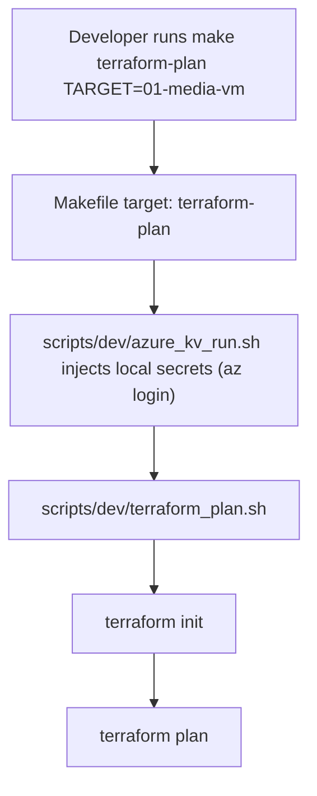
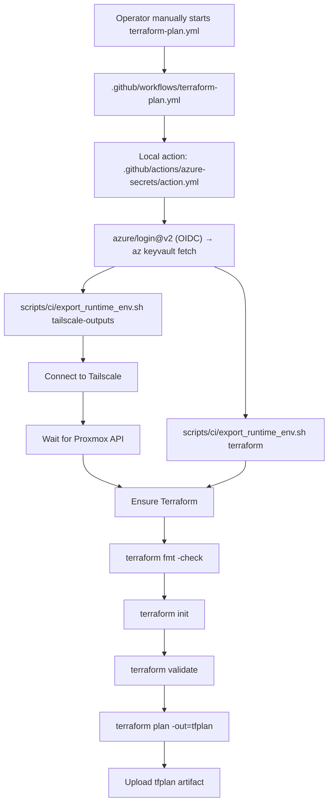
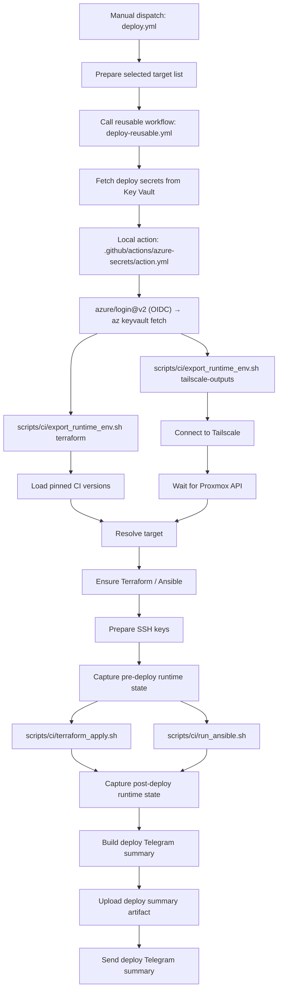
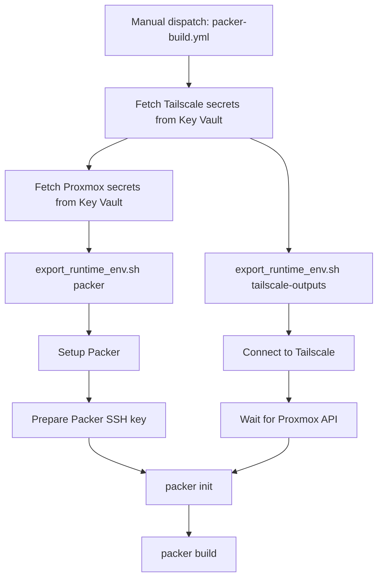
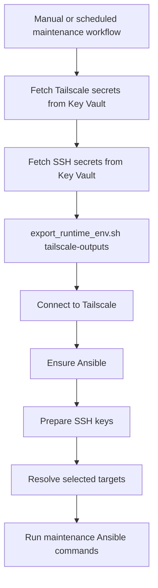
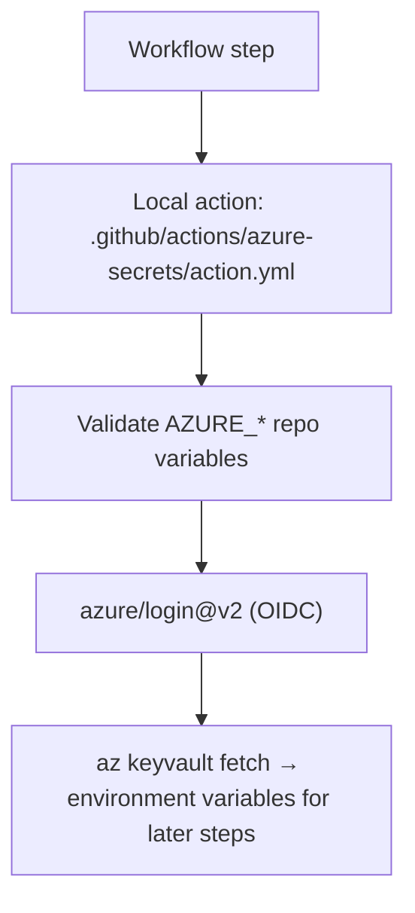

# CI Workflow Map

This repo has two execution paths that look similar but run in different places:

- Local workflows run from the `Makefile` on a developer machine.
- GitHub Actions workflows run from `.github/workflows/*.yml` on GitHub-hosted runners.

The important distinction is that local Terraform planning uses `scripts/dev/terraform_plan.sh`, while GitHub Actions uses workflow YAML plus CI helper scripts under `scripts/ci/`.

Both paths read runtime secrets from the same **Azure Key Vault** (`kv-homelab-prod`): locally via your `az login` session, and in CI via GitHub OIDC. See [github-secrets.md](github-secrets.md) for the secret reference.

For the check-by-check validation reference, including local hook stages and
pull-request scope, see [validation-checks.md](validation-checks.md).

## Workflow Inventory

| Workflow | Trigger | Secrets | Main purpose |
|---|---|---|---|
| `actionlint.yml` | PR touching `.github/workflows/**` or its version pin | None | Lint changed workflow syntax and shell snippets with `actionlint` |
| `ansible-lint.yml` | Push / PR touching `ansible/**`, or `workflow_call` | None | Install Ansible and run `ansible-lint` |
| `deploy.yml` | Manual dispatch | Delegates to `deploy-reusable.yml` | Collect target inputs and call reusable deploy |
| `deploy-reusable.yml` | `workflow_call` | Key Vault (all folders) | Shared Terraform apply and Ansible deploy implementation |
| `gitleaks.yml` | Push / PR | None | Scan repository history/content for leaked secrets |
| `maintenance-monitoring.yml` | Manual dispatch | Key Vault `tailscale` + `ssh` | Enable observability agents on selected hosts |
| `maintenance-support-access.yml` | Manual dispatch | Key Vault `tailscale` + `ssh` | Prepare SSH/support access to selected hosts |
| `maintenance-upgrades.yml` | Weekly schedule / manual dispatch | Key Vault `tailscale` + `ssh` | Upgrade selected hosts and upload reports |
| `packer-build.yml` | Manual dispatch | Key Vault `tailscale` + `proxmox` + `ssh` | Build and upload base VM images |
| `packer-validate.yml` | PR touching `infra-images/packer/**` | None | Run `packer fmt`, `init`, and `validate` |
| `pre-commit.yml` | Pull request | None | Enforce fast file, Python, and SSH trust metadata hooks on changed files |
| `pr-ready-notify.yml` | PR opened, reopened, or marked ready for review | Key Vault `ci` | Send a Telegram notification that a non-draft PR is ready for human review/merge |
| `runner-smoke.yml` | Manual dispatch | None | Print basic runner diagnostics |
| `shellcheck.yml` | PR touching `scripts/**` | None | Run ShellCheck over changed shell scripts |
| `telegram-notify.yml` | Watched workflow completion | Key Vault `ci` | Send Telegram workflow notifications |
| `terraform-lint.yml` | Push / PR touching Terraform code | None | Run `tflint` and `checkov` |
| `terraform-plan.yml` | Manual dispatch | Key Vault `tailscale` + `proxmox` + `terraform` | Manually run Terraform fmt, validate, and plan |
| `trivy.yml` | PR touching Ansible image pins; daily schedule; manual dispatch | None | **Currently skipped** — the `trivy` job is gated on repo variable `TRIVY_ENABLED` (unset → skipped; kept, not removed; re-enable by setting `TRIVY_ENABLED=true`). Scan changed pinned images on PRs and all pinned images daily |

File-local pull-request validation (`pre-commit`, `actionlint`, and
`shellcheck`) evaluates only the PR diff. Subsystem validation intentionally
runs over the affected scope: Ansible imports roles and vars across files;
Packer and Terraform can share pins or modules; Checkov and gitleaks provide
security coverage that should not be reduced to changed lines. Local
`make ci` remains the full pre-PR baseline check. When a file-local checker
workflow, hook configuration, or relevant tool pin changes, that checker runs
its full baseline once to validate the new validation behavior itself.

Trivy treats container image pins in `ansible/host_vars/**` and
`ansible/roles/**/defaults/main.y*ml` as deployment inputs. Image-changing
pull requests scan the introduced image references; workflow or extractor
changes, manual runs, and the daily schedule scan the full inventory.

## Shared Key Vault Pattern

Workflows that need LAN, Proxmox, Terraform Cloud, SSH, Packer, or notification secrets all use the same local action wrapper, which authenticates to Azure via GitHub OIDC (no stored client secret) and loads secrets into the job environment:



The action needs `permissions: id-token: write` in the calling job (already set on every workflow that uses it). A `folder:` input scopes the fetch to one Key Vault `folder` tag; omitting it fetches all secrets.

`export_runtime_env.sh` is only needed when a workflow must rename Key-Vault-provided variables into tool-specific runtime names:

- Terraform: `terraform-plan.yml` and `deploy-reusable.yml`
- Tailscale: `terraform-plan.yml`, `deploy-reusable.yml`, `packer-build.yml`, and maintenance workflows
- Packer: `packer-build.yml`

Workflows that only need secrets directly, such as `telegram-notify.yml`, can call the fetch action without using the export script.

## Local Terraform Plan

Run from a local shell:

```bash
make terraform-plan TARGET=01-media-vm
```

or for every stack:

```bash
make terraform-plan-all
```

Flow:



`scripts/dev/terraform_plan.sh` is only for local development. It is called by:

- `Makefile` target `terraform-plan`
- `Makefile` target `terraform-plan-all`

GitHub Actions does not call this script.

## GitHub Actions Terraform Plan

Triggered only by manual dispatch:

```text
.github/workflows/terraform-plan.yml
```

Flow:



The plan workflow fetches secrets from Key Vault, exports them into Terraform and Tailscale runtime names, connects the runner to the LAN with Tailscale, then runs Terraform directly in each stack directory. It is intentionally manual so no PR, push, or merge can contact Proxmox or run a live plan without an operator starting it.

The Terraform plan and lint matrices are generated by
`scripts/ci/build_terraform_stack_matrix.py`. Every directory under
`infra-proxmox/terraform/` that contains `backend.tf` is treated as a managed
stack. Terraform lint runs automatically for relevant PRs; live Terraform plan
coverage runs only when manually dispatched.

## GitHub Actions Deploy

Manual deploy starts from:

```text
.github/workflows/deploy.yml
```

`deploy.yml` does not fetch Key Vault secrets directly. It requires an explicit
deployment mode, collects the selected targets, and calls the reusable deploy
workflow:

```text
.github/workflows/deploy-reusable.yml
```

Flow:



Deploy has one extra layer because `deploy-reusable.yml` can be called by other workflows later. The manual entrypoint stays small, and the real deploy implementation lives in one reusable place.

Deploy target selection is driven by `scripts/ci/targets.sh` and the manual
inputs in `deploy.yml`. The dispatcher has no operational default mode: select
`Configuration only`, `Infrastructure only`, or `Full deploy` deliberately.
The reusable workflow validates that mode before accessing deploy secrets,
receives a JSON target list, and expands it into a matrix.

Deployment and maintenance workflows pin the Proxmox host in the committed
`ansible/ssh_known_hosts` trust store. Before connecting directly to a guest,
they ask verified `pve` to confirm the target's reviewed VMID/name binding,
read that VM/LXC's SSH public host key, and write a temporary runner-local
trust file. Strict host-key checking remains enabled, while a routine guest
rebuild no longer needs a manual key update. A replaced `pve` must still be
verified out of band as documented in `docs/ssh.md`.

For configuration-capable deploy modes, `deploy-reusable.yml` also captures
before/after runtime state, builds a deploy summary artifact, and sends a
Telegram summary. `Configuration only` disables rootfs expansion and package
upgrades; `Full deploy` enables them. Infrastructure-only deploys skip the
Ansible and summary path.

## GitHub Actions Packer Build

Manual base image builds start from:

```text
.github/workflows/packer-build.yml
```

Flow:



`packer-validate.yml` is separate. It runs on pull requests that touch Packer templates and does not need Key Vault, Tailscale, or Proxmox access.

## GitHub Actions Maintenance

The maintenance workflows share the same connection shape:



Current maintenance workflows:

- `maintenance-upgrades.yml` upgrades selected hosts, captures package snapshots, builds a report, and uploads it as an artifact. It runs weekly and can also be dispatched manually.
- `maintenance-monitoring.yml` waits for selected hosts and enables observability agents.
- `maintenance-support-access.yml` installs `sshpass`, prepares SSH keys, and waits for selected hosts so support access can be verified.

All three resolve selected hosts through `scripts/ci/resolve_maintenance_targets.sh`.

## Notification and Validation Workflows

`pr-ready-notify.yml` sends a Telegram notification when a non-draft PR is
opened, reopened, or marked ready for review. It is notification-only: it does
not merge, run Terraform plan, deploy, or contact Proxmox.

`telegram-notify.yml` runs after watched workflows complete. It fetches
notification secrets from Key Vault, downloads workflow/job status from the
GitHub API, and sends Telegram notifications.

The following workflows do not use Key Vault:

- `actionlint.yml`
- `ansible-lint.yml`
- `gitleaks.yml`
- `packer-validate.yml`
- `runner-smoke.yml`
- `shellcheck.yml`
- `terraform-lint.yml`
- `trivy.yml`

## Local Action Wrapper

The workflows call this local action:

```yaml
uses: ./.github/actions/azure-secrets
```

That local action is defined here:

```text
.github/actions/azure-secrets/action.yml
```

Inside it, authentication uses the official Azure login action with OIDC, then the Azure CLI reads the vault:

```yaml
uses: azure/login@v2          # OIDC, no client secret
# then: az keyvault secret list/show → $GITHUB_ENV
```

The wrapper keeps shared Azure setup in one place. Workflows do not need to repeat the OIDC login, variable validation, and Key Vault fetch every time they need secrets:



Each secret's `envvar` tag is used as the exported variable name, so downstream scripts see the original names (e.g. `PROXMOX_API_URL`) regardless of the Key Vault slug.

## Runtime Export Script

`scripts/ci/export_runtime_env.sh` does not fetch secrets. It assumes the `azure-secrets` action already loaded them into the job environment.

Its job is to validate and rename those secrets into the names required by downstream tools.

Terraform mode:

```bash
bash scripts/ci/export_runtime_env.sh terraform
```

Writes values to `$GITHUB_ENV`, for example:

```text
PROXMOX_API_URL              -> TF_VAR_proxmox_url
PROXMOX_TOKEN_ID             -> TF_VAR_proxmox_token_id
PROXMOX_TOKEN_SECRET         -> TF_VAR_proxmox_token_secret
TF_TOKEN_APP_TERRAFORM_IO    -> TF_TOKEN_app_terraform_io
TF_VAR_BOOTSTRAP_PASSWORD    -> TF_VAR_bootstrap_password
```

Tailscale output mode:

```bash
bash scripts/ci/export_runtime_env.sh tailscale-outputs
```

Writes values to `$GITHUB_OUTPUT`, so later workflow steps can use:

```yaml
oauth-client-id: ${{ steps.tailscale.outputs.oauth_client_id }}
oauth-secret: ${{ steps.tailscale.outputs.oauth_secret }}
```

Packer mode:

```bash
bash scripts/ci/export_runtime_env.sh packer
```

Writes Proxmox values into Packer variable names:

```text
PROXMOX_API_URL       -> PKR_VAR_proxmox_url
PROXMOX_TOKEN_ID      -> PKR_VAR_proxmox_token_id
PROXMOX_TOKEN_SECRET  -> PKR_VAR_proxmox_token_secret
```

## Quick Mental Model

```text
Local plan:
make -> scripts/dev/azure_kv_run.sh (az login) -> scripts/dev/terraform_plan.sh -> terraform plan

Manual GitHub plan:
operator dispatches terraform-plan.yml -> azure-secrets action (OIDC) -> export_runtime_env.sh -> terraform plan

GitHub deploy:
deploy.yml -> deploy-reusable.yml -> azure-secrets action (OIDC) -> export_runtime_env.sh -> terraform_apply.sh / run_ansible.sh

Packer build:
packer-build.yml -> azure-secrets action (OIDC) -> export_runtime_env.sh -> packer build

Maintenance:
maintenance-*.yml -> azure-secrets action (OIDC) -> Tailscale -> Ansible maintenance task
```
