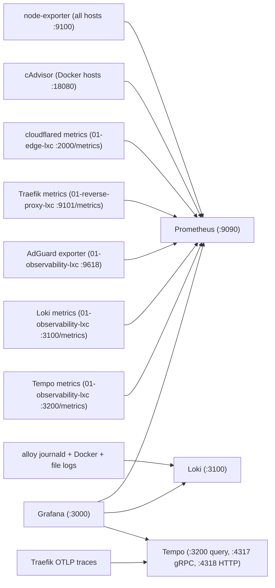

# Observability Working Method

This document explains how logs, metrics, and traces are collected in the homelab today, which hosts participate, and where the current blind spots still are.

## 1) Deployment Entry Points

Observability is deployed from Ansible in two layers:

- `ansible/playbooks/bootstrap/00-observability-agents.yml`
  - installs `prometheus-node-exporter` on all inventory hosts
  - installs `alloy` on all inventory hosts for log collection
  - enables `cadvisor` on Docker hosts only:
    - `01-media-vm`
    - `01-myapps-vm`
    - `01-torrent-lxc`
    - `01-observability-lxc`
- `ansible/playbooks/services/01-observability-lxc.yml`
  - deploys the core stack on `01-observability-lxc`:
    - Grafana
    - Prometheus
    - Loki
    - Tempo
    - AdGuard exporter

Supported deployment paths:

- `make deploy TARGET=01-observability-lxc MODE=config`
  - reconciles the core stack and the selected host's agent configuration
- `make deploy-all MODE=config`
  - reconciles agent and service configuration sequentially across all targets

GitHub Actions entry point:

- `.github/workflows/maintenance-monitoring.yml`
  - runs `bootstrap/00-observability-agents.yml` for selected hosts

## 2) What Collects What

The split is:

- `alloy` = logs
- `prometheus-node-exporter` = host metrics
- `cadvisor` = container metrics
- app-native endpoints and OTEL exporters = service metrics and traces

Current app-native tracing and metrics producers:

- `traefik-edge`
  - traces to Tempo over OTLP gRPC on `01-observability-lxc:4317`
  - metrics scraped by Prometheus from `01-reverse-proxy-lxc:9101`

`openclaw-gateway` is deprecated and is not part of the deployed observability surface.

Important limitation:

- logs and metrics do not automatically create traces
- an app only appears in Tempo if it is explicitly instrumented for OTEL

## 3) Data Flow Wiring



## 4) Logs Collection

`alloy` currently collects three log classes through native Alloy components:

- `systemd-journal`
  - enabled on all inventory hosts
  - catches service logs such as AdGuard Home, Docker daemon, and other systemd units
- `docker`
  - enabled on:
    - `01-media-vm`
    - `01-myapps-vm`
    - `01-torrent-lxc`
    - `01-observability-lxc`
  - collects container stdout and stderr via `docker_sd_configs`
- `media-app-file-logs`
  - enabled only from `01-media-vm`
  - tails selected files under shared `/srv/appdata`
  - relabels some entries to the logical owning host even when the file is read from the shared mount

Selected file-log coverage today:

- `plex`
- `radarr`
- `sonarr`
- `prowlarr`
- `bazarr`
- `tautulli`
- `overseerr`
- `qbittorrent`
- `codex-tui`

Important nuance:

- file-log scraping is not universal
- if an app logs only to a file inside a container filesystem and that file is not mounted and configured in Alloy, Loki will not see it

## 5) Metrics Collection

Prometheus currently scrapes these jobs from `ansible/playbooks/services/01-observability-lxc.yml`:

- `prometheus`
- `node-exporter`
- `cadvisor`
- `cloudflared`
- `traefik`
- `adguard`
- `loki`
- `tempo`

Key targets:

- `node-exporter`
  - `01-media-vm.home.arpa:9100`
  - `01-myapps-vm.home.arpa:9100`
  - `01-torrent-lxc.home.arpa:9100`
  - `01-observability-lxc.home.arpa:9100`
  - `01-backup-lxc.home.arpa:9100`
  - `01-edge-lxc.home.arpa:9100`
  - `01-dns-lxc.home.arpa:9100`
  - `01-reverse-proxy-lxc.home.arpa:9100`
  - `01-tailscale-lxc.home.arpa:9100`
- `cadvisor`
  - `01-media-vm.home.arpa:18080`
  - `01-myapps-vm.home.arpa:18080`
  - `01-torrent-lxc.home.arpa:18080`
  - `01-observability-lxc.home.arpa:18080`
- `cloudflared`
  - `01-edge-lxc.home.arpa:2000/metrics`
- `traefik`
  - `01-reverse-proxy-lxc.home.arpa:9101/metrics`
- `adguard`
  - `adguard-exporter:9618`
- `loki`
  - `01-observability-lxc.home.arpa:3100/metrics`
- `tempo`
  - `01-observability-lxc.home.arpa:3200/metrics`

Prometheus is also configured with `--web.enable-otlp-receiver`, so instrumented services can push OTLP metrics directly.

## 6) Traces Collection

Tempo receives traces on:

- OTLP gRPC: `01-observability-lxc:4317`
- OTLP HTTP: `01-observability-lxc:4318`

Tempo query UI and Grafana datasource use:

- `01-observability-lxc:3200`

Tempo also has `metrics_generator` enabled with the `local-blocks` processor. That is required for Grafana Trace Drilldown features such as:

- Breakdown
- Service structure
- Comparison

Trace-capable services today:

- `traefik-edge`

Known end-to-end chains that exist today:

- none — `traefik-edge` emits spans, but its current downstream services are not OTEL-instrumented

Why some apps do not appear in traces:

- Plex, qBittorrent, Radarr, Sonarr, Bazarr, and similar apps are not automatically trace-capable
- they may expose logs and metrics, but they do not emit OTEL spans unless they are explicitly instrumented
- in practice, many third-party homelab apps remain logs-plus-metrics only

## 7) Host Coverage Map

- `01-media-vm`
  - journald logs
  - Docker container logs
  - cAdvisor container metrics
  - selected appdata file logs
- `01-torrent-lxc`
  - journald logs
  - Docker container logs
  - cAdvisor container metrics
  - qBittorrent file log via shared appdata scrape
- `01-myapps-vm`
  - journald logs
  - Docker container logs
  - cAdvisor container metrics
  - node-exporter metrics
  - journald logs
  - `codex-tui` file log via shared appdata scrape
- `01-observability-lxc`
  - journald logs
  - Docker container logs
  - cAdvisor container metrics
  - Prometheus, Loki, Tempo, and Grafana stack metrics
  - AdGuard exporter
- `01-dns-lxc`
  - journald logs
  - node-exporter metrics
  - AdGuard metrics exposed indirectly through the exporter on `01-observability-lxc`
- `01-edge-lxc`
  - journald logs
  - node-exporter metrics
  - cloudflared metrics
- `01-reverse-proxy-lxc`
  - journald logs
  - node-exporter metrics
  - Traefik metrics
  - Traefik traces
- `01-backup-lxc`
  - journald logs
  - node-exporter metrics only
- `01-tailscale-lxc`
  - journald logs
  - node-exporter metrics only

## 8) Intentional Blind Spots

- the Proxmox host is intentionally not collected from this stack
- not every app has file-log scraping
- not every app has native metrics
- not every app is trace-capable

So the operating model is:

- logs for broad coverage
- metrics for health and capacity
- traces for the apps we control or can instrument

## 9) Runtime Locations

On `01-observability-lxc`:

- Compose file: `/opt/observability/compose.yml`
- Env file: `/opt/observability/.env`
- Prometheus config: `/srv/appdata/observability/prometheus/prometheus.yml`
- Grafana data: `/srv/appdata/observability/grafana/data`
- Grafana dashboard provider config: `/srv/appdata/observability/grafana/provisioning/dashboards/dashboards.yml`
- Grafana provisioned dashboards: `/srv/appdata/observability/grafana/provisioning/dashboards/homelab`
- Loki data: `/srv/appdata/observability/loki/data`
- Tempo config: `/srv/appdata/observability/tempo/tempo.yaml`
- Tempo data: `/srv/appdata/observability/tempo/data`
- Systemd unit: `observability.service`

On agents:

- Alloy binary: `/usr/local/bin/alloy`
- Alloy config: `/etc/alloy/config.alloy`
- Alloy storage path: `/var/lib/alloy`
- Systemd unit: `alloy.service`

## 10) Apply and Verify

Apply core stack:

```bash
make deploy TARGET=01-observability-lxc MODE=config
```

Apply agents:

```bash
ansible-playbook -i ansible/inventory.ini ansible/playbooks/bootstrap/00-observability-agents.yml
```

Quick checks:

- Prometheus targets:
  - `http://01-observability-lxc.home.arpa:9090/targets`
- Grafana:
  - `http://grafana.example.com`
- Alloy logs:
  - `journalctl -u alloy -f`
- Tempo readiness:
  - `curl -fsS http://01-observability-lxc.home.arpa:3200/ready`
- Loki readiness:
  - `curl -fsS http://01-observability-lxc.home.arpa:3100/ready`

## 11) Alerting Thresholds

These are the recommended Grafana alert thresholds for this homelab. Alerts are evaluated against Prometheus metrics unless noted.

### Host availability

| Alert | Condition | Window |
|-------|-----------|--------|
| Host unreachable | `up{job="node-exporter"} == 0` | 5 min |
| Container service down | `up{job="cadvisor"} == 0` | 5 min |

### Disk

| Alert | Condition | Window |
|-------|-----------|--------|
| Disk usage high | Warning: `(node_filesystem_avail_bytes / node_filesystem_size_bytes) < 0.05`; critical: `< 0.01` on any mounted fs | warning 15 min, critical 10 min |
| Disk filling fast | predicted to run out in < 4 hours based on 6 h linear fit | — |

### Memory & CPU

| Alert | Condition | Window |
|-------|-----------|--------|
| Memory pressure | `(node_memory_MemAvailable_bytes / node_memory_MemTotal_bytes) < 0.10` | 10 min |
| Sustained CPU saturation | `avg by (instance)(rate(node_cpu_seconds_total{mode!="idle"}[5m])) > 0.90` | 15 min |

### DNS (from the IPv6 latency incident)

| Alert | Condition | Window |
|-------|-----------|--------|
| AdGuard DNS processing p95 | `histogram_quantile(0.95, sum(rate(adguard_processing_time_seconds_bucket[5m])) by (le)) > 0.12` | 10 min |
| AdGuard upstream error rate | `rate(adguard_upstream_responses_total{status="error"}[5m]) > 0.05` | 5 min |

### HTTP / Traefik

| Alert | Condition | Window |
|-------|-----------|--------|
| High 5xx error rate | `rate(traefik_service_requests_total{code=~"5.."}[5m]) / rate(traefik_service_requests_total[5m]) > 0.05` | 5 min |
| Traefik service down | no successful requests for a known service for > 10 min | — |

### Backup

| Alert | Condition | Window |
|-------|-----------|--------|
| Backup stale | last successful restic run systemd unit exit code != 0, or no successful completion in 25 h | — |

The backup timer runs daily on `01-backup-lxc`. Monitor via `journalctl -u restic-backup.service` or expose the last-success timestamp as a Prometheus pushgateway metric if you want Grafana alerting.

### Observability stack self-health

| Alert | Condition | Window |
|-------|-----------|--------|
| Loki ingestion stopped | `rate(loki_ingester_chunks_flushed_total[10m]) == 0` | 10 min |
| Prometheus scrape failures | `rate(prometheus_target_scrapes_exceeded_sample_limit_total[5m]) > 0` | 5 min |
| Tempo rejected spans or failed flushes | `sum(increase(tempo_receiver_refused_spans[5m])) > 0 or sum(increase(tempo_ingester_failed_flushes_total[5m])) > 0` | 5 min |
